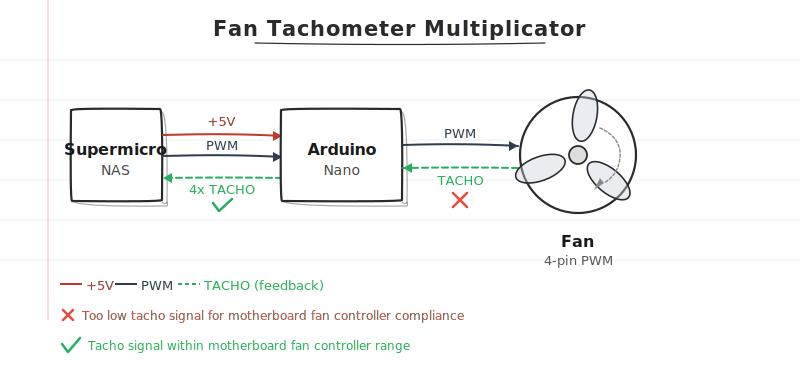
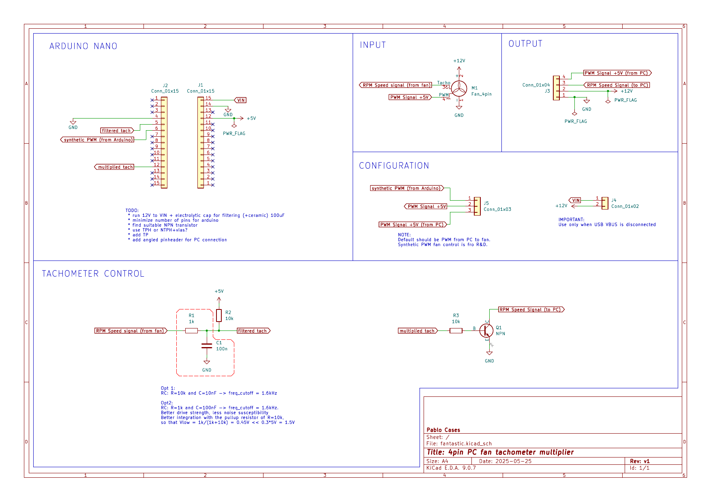
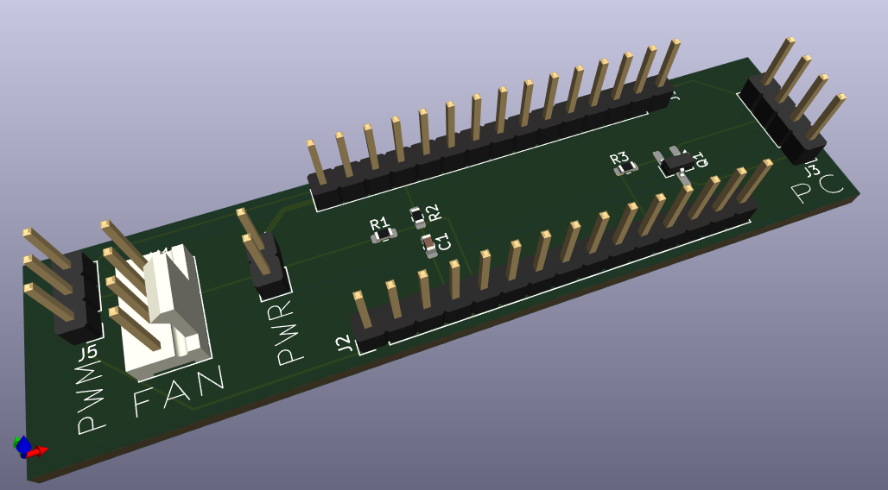

# fantastic

ATmega-based inline fan tachometer frequency multiplier for low-RPM PWM fans on motherboards that expect higher tachometer rates.



## Problem Background

The target motherboard (Supermicro X10SLM-F) fan controller is designed for high-speed fans and tends to report low-RPM Noctua fans as `0 RPM` intermittently, especially below ~300 RPM.

When this happens, the board reacts aggressively:
- temporary non-recoverable (`nr`) fan status,
- fan fail warnings,
- fan duty jumping to 100% until tachometer readings recover.

Even after lowering thresholds through IPMI, false `0 RPM` detections may still happen.

## Solution

Use a small ATmega board inline on the tachometer path:
- read incoming fan tachometer pulses,
- calculate frequency/RPM,
- generate a new tachometer output waveform multiplied by `x4`,
- feed that multiplied signal to the motherboard fan header.

With a `x4` multiplier, a real fan range of roughly `150-1500 RPM` appears as `600-6000 RPM` to the motherboard.

## Repository Contents

- `fantastic.ino`: firmware for measurement, filtering, and output waveform generation.

## Hardware Design Files

> Warning: The documented KiCad schematic/PCB has not been validated in a physical PCB build yet. Current results are from the initial hand-built proto-board prototype.

- Schematic PDF: [`media/schematics.pdf`](media/schematics.pdf)

Schematic preview (page 1):



3D board view:



## Firmware Behavior

The sketch:
- reads tach pulses using interrupt-based timing (`PIN_SENSE = 2`),
- smooths period jitter using a short rolling average,
- computes input RPM/frequency,
- updates output only when the measured input frequency changes,
- generates output tach waveform on `PIN_TACH_OUT = 9` (Timer1, 50% duty),
- optionally generates 25 kHz fan-control PWM on `PIN_PWM_OUT = 3` (Timer2).

Default behavior keeps interrupt-based measurement enabled and serial command input configured for PWM duty testing.

## IPMI Threshold Examples

### Baseline (often insufficient for low-RPM fans)

```bash
ipmitool sensor thresh "FAN2" lower 0 0 100
```

### Thresholds used with x4 multiplier

```bash
ipmitool sensor thresh "FAN2" lower 300 400 500
ipmitool sensor thresh "FAN2" upper 6500 6600 6700
```

### Live monitoring

```bash
while true; do ipmitool sensor | grep "FAN[2,4]"; sleep 1; done
```

## Example Runtime Output

```text
Input :                 Freq (mHz): 9174        Freq (Hz): 9    RPM: 275
Output:                 Freq (mHz): 36696       Freq (Hz): 37   RPM: 1100
```

The output updates only when input frequency changes, reducing unnecessary reprogramming of timer TOP values.

## Sample Sensor Output Reference

### Before multiplier (example with intermittent low/zero readings)

| Sensor | Reading | Unit | Status | LNR | LCR | LNC | UNC | UCR | UNR |
|---|---:|---|---|---:|---:|---:|---:|---:|---:|
| FAN2 | 300.000 | RPM | ok | 0.000 | 0.000 | 100.000 | 1700.000 | 1800.000 | 1900.000 |
| FAN4 | 200.000 | RPM | ok | 0.000 | 0.000 | 100.000 | 1700.000 | 1800.000 | 1900.000 |
| FAN2 | 300.000 | RPM | ok | 0.000 | 0.000 | 100.000 | 1700.000 | 1800.000 | 1900.000 |
| FAN4 | 0.000 | RPM | nr | 0.000 | 0.000 | 100.000 | 1700.000 | 1800.000 | 1900.000 |
| FAN2 | 1400.000 | RPM | ok | 0.000 | 0.000 | 100.000 | 1700.000 | 1800.000 | 1900.000 |
| FAN4 | 1200.000 | RPM | ok | 0.000 | 0.000 | 100.000 | 1700.000 | 1800.000 | 1900.000 |
| FAN2 | 300.000 | RPM | ok | 0.000 | 0.000 | 100.000 | 1700.000 | 1800.000 | 1900.000 |
| FAN4 | 300.000 | RPM | ok | 0.000 | 0.000 | 100.000 | 1700.000 | 1800.000 | 1900.000 |

### After multiplier + adjusted thresholds

| Sensor | Reading | Unit | Status | LNR | LCR | LNC | UNC | UCR | UNR |
|---|---:|---|---|---:|---:|---:|---:|---:|---:|
| FAN2 | 800.000 | RPM | ok | 300.000 | 400.000 | 500.000 | 6500.000 | 6600.000 | 6700.000 |
| FAN4 | 1100.000 | RPM | ok | 300.000 | 400.000 | 500.000 | 6500.000 | 6600.000 | 6700.000 |

Observed steady-state mapping from original fan RPM to reported RPM:

| Channel | Original RPM | Multiplied RPM |
|---|---:|---:|
| FAN2 | 200 | 800 |
| FAN4 | 275 | 1100 |

## Sample Serial Log Reference

```text
Input :                 Freq (mHz): 9174        Freq (Hz): 9    RPM: 275
Output:                 Freq (mHz): 36696       Freq (Hz): 37   RPM: 1100

Input :                 Freq (mHz): 9174        Freq (Hz): 9    RPM: 275
Input :                 Freq (mHz): 9174        Freq (Hz): 9    RPM: 275
Input :                 Freq (mHz): 9174        Freq (Hz): 9    RPM: 275
Input :                 Freq (mHz): 9091        Freq (Hz): 9    RPM: 273
Output:                 Freq (mHz): 36364       Freq (Hz): 36   RPM: 1092

Input :                 Freq (mHz): 9091        Freq (Hz): 9    RPM: 273
Input :                 Freq (mHz): 9174        Freq (Hz): 9    RPM: 275
Output:                 Freq (mHz): 36696       Freq (Hz): 37   RPM: 1100
```

## Design Goals

Input range:
- RPM: `0-2000`
- Frequency: `0-33 Hz`

Output range (with x4 multiplier):
- RPM: `0-8000`
- Frequency: `0-133 Hz`

## Hardware Notes / Lessons Learned

- Use a common ground between fan supply (12V domain) and ATmega (5V domain).
- 25 kHz PWM noise can couple into tachometer/ground; use RC filtering on tach input.
- Use a base resistor on the open-collector NPN stage to keep logic-high levels well-behaved.
- Verify both input and output waveforms on an oscilloscope during bring-up.

## Fan Reference

Noctua PWM specification white paper:
- https://noctua.at/pub/media/wysiwyg/Noctua_PWM_specifications_white_paper.pdf

Measured Noctua F/P12 duty-to-RPM values:

| PWM duty | RPM |
|---|---:|
| 100% | 1364 |
| 90% | 1200 |
| 80% | 1111 |
| 70% | 1000 |
| 60% | 882 |
| 50% | 750 |
| 40% | 588 |
| 30% | 417 |
| 20% | 291 |
| 10% | 137 |
| 0% | 0 |
